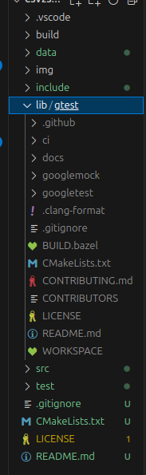

# csv-sqlite Importer

Console app for importing data from table in a csv file to a sqlite3 database.

## Purpose 🤔

The objetive of this small project is import information from csvs files(from online sites, like [www.kaggle.com](www.kaggle.com)) to small databases in order to process or apply some machine learning algorithms to them.

## System requirements  for building 📝

You must install a decompressed version of googletest 1.21.1 in a /lib folder.
<details><summary>Directory for building🔍</summary><br>

</details>

## System requirements  for running 📝

The system must have installed sqlite3, in Linux Systems:

```bash
sudo apt-get install libsqlite3-0 sqlite3_analyzer 
```

## Documentation 📚

In order to build the documentation, you must have installed doxygen

```bash
sudo apt-get install doxygen
sudo apt-get install graphviz
```

## Building 🛠️

```bash
mkdir build
cd build
cmake ..
cmake --build .
```

## Example of use 💡

```bash
csv2sqlite3 -f data.csv -i data.txt -o databaseName -t tableName
```

Where 'data.csv' is the file with the data, 'data.txt' contains information of data type in each column, 'databaseName' is the name of the database, it will create a new one or update a previous. And 'tableName' is the name of the table.

<details><summary>Example of the content of a 'data.txt' file🔍</summary><br>

```bash
INT,TEXT,TEXT,INT
```

</details>


## Result ⚙️

Tested importing 72274 registers (about 3.7 MB). 

## Licence 📄

This project is under ([MIT](https://choosealicense.com/licenses/mit/)) license. You can read the file [LICENSE.md](LICENSE.md) in order to learn how to use the material.
